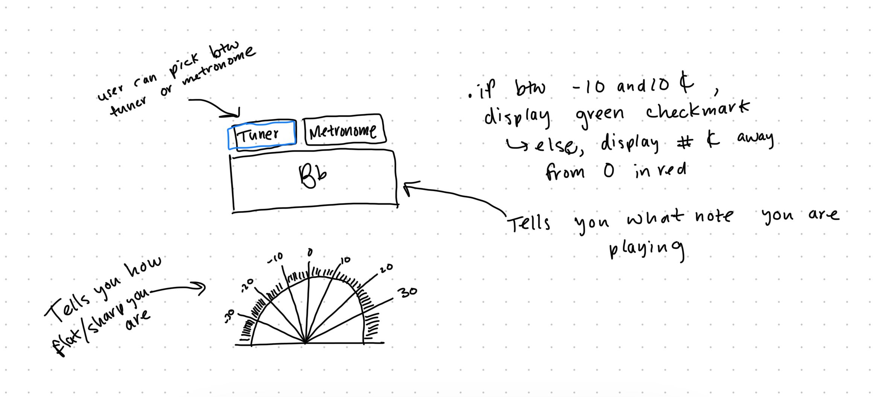
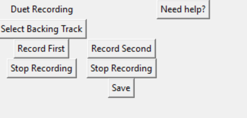

:warning: Everything between << >> needs to be replaced (remove << >> after replacing)

# Project: Duet Recording 
## CS110 Final Project; Fall, 2024

## Team members

Allison Austin
***

## Project Description

This project is meant to overlay two audio files to simulate a "duet", 
where the user can create 2 different recordings and combine them. I also 
made it so that the user can select their own backing track on their recording
instead of making 2 separate recordings.
***    

## GUI Design

### Initial Design

### Final Design

## Program Design

### Features

1. Start menu
2. Help button with instructions
3. Displays when recordings are in progress
4. displays when recordings are stopped
5. Allows user to select backing track

### Classes

- Audio - takes in audio input from recordings and overlays the second recording with
  a backing track
- Buttons - makes buttons for the GUI

## Additional Modules
- tkinter
- pydub
- wave
- threading
- pyaudio

## References
- Microsoft Copilot

## ATP

Test Case 1: first recording
1. click "Record First" button
2. Should display "Recording in progress" while recording
3. click the first "Stop recording" button
4. should stop the recording
5. Verify the first recording is saved as "recorded_audio1.wav"

Test Case 2: second recording
1. click "Record Second" button
2. Should display "Recording in progress" while recording
3. click the second "Stop recording" button
4. should stop the recording

Test Case 3: help button
1. click "Need Help?" button
2. Verify that this displays instructions for the program

Test Case 4: backing track
1. click "Select Backing Track"
2. Should be able to select only wav files
3. Verify that you can select a wav file and add it to your existing audio

Test Case 5: overlay audio
1. click "Save" once audio is recorded
2. Verify that you can save the combined audio
3. Verify that the resulting wav file plays the overlayed audio

